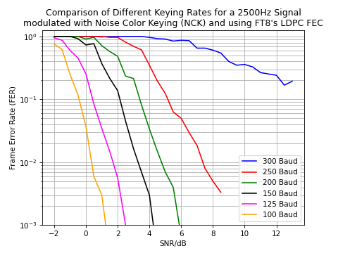
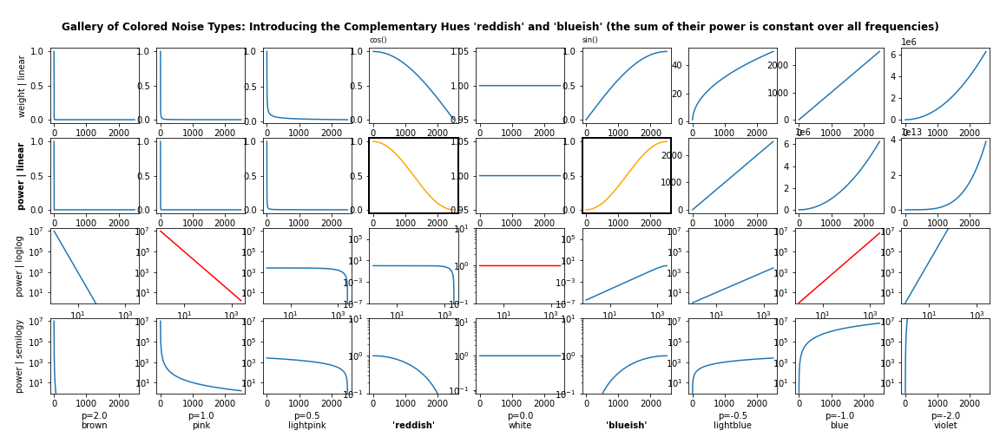
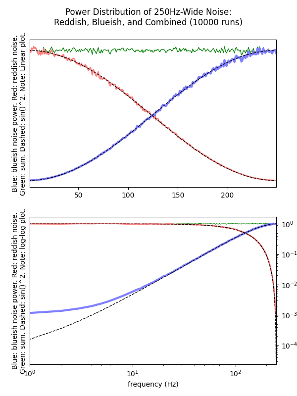

# Noise Color Keying (NCK)

NCK modulation is an experimental waveform for radio amateurs and is
demonstrated in this repository for audio channels of 2.5kHz.

## 1) Introduction

NCK uses two distinct noise colors to encode bits, while the
traditional methods like FSK and PSK use a signal's frequency or phase
to this end. Specially crafted noise hues, called "reddish" and
"blueish", were designed such that the signal's averaged power over
time looks like white noise i.e., has a flat frequency
distribution. This makes NCK a quite robust modulation technique as no
frequency or phase constellation of the signal carries special
significance - it's all encoded in the noise' hue.

One advantage of NCK is that modulation as well as demodulation is
computationally very cheap because not FFT or similar technique is
required. Signal generation is based on either low- or highpass
filtering white noise, using a simple subtraction or addition
operation. Demodulation uses the lag1-autocorrelation metric that is
similarly cheap to compute. We therefore envisage NCK to be
attractive for environments with very constraint compute resources.

By itself, NCK has terrible BER performance: It cannot reliably
delivery bits due to the stochastic nature of the noise used which
leads to bit errors in almost every frame, regardless of the chosen
SNR level. Forward Error Correction (FEC) is thus needed where
computationally cheap methods are recommended e.g., (7,4) Hamming or
(23,12,8) extended Golay. The following figure shows the performance
of NCK in a AWGN channel. Note that this simulation used a
computationally heavy FEC method, LDPC, in order to allow some
comparisons with the well-known FT8 weak signal modulation and
encoding.



Reducing the keying rate improves sensitivity a lot: By having longer
symbol times, the receiver can better average the colored noise
symbols which improves the quality of the lag1-autocorrelation and
therefore the accuracy of the demodulation.


## 2) Files

The most relevant files are:

- ```doc``` -- PDF for various generated graphs, as well as the NCK whitepaper
- ```py/nck.py``` -- Noice Color Keying library
- ```py/demo-nck.py``` -- shows the working of NCK with modulation and demodulation

Auxiliary files:

- ```py/ft8_coding.py``` -- LDPC and CRC routines
- ```py/sp.py``` -- draws spectrogram for ```out.wav```, or some given file
- ```py/mk_nck-hue_power_sum.py``` -- simulate blueish and reddish noise, show power sum
- ```py/mk_nck-noise-gallery.py``` -- generates graphs for various noise colors
- ```py/mk_nck-fer_vs_snr_vs_kr.py``` -- generates above FER-vs-SNR graph


## 3) Gallery of Colored Noise Types

In ```doc/nck-noise-gallery.pdf```, also shown below, each column
stands for a different noise types.



- The first row shows the weights that each frequency receives, in a linear plot.
- The second row shows the resulting power distribution, per frequency. Again, the plots on this row are linear.
- The third row shows the same power distribution, but this time in a log-log plot. This representation is typically found in descriptions of colored noise (brown, pink, white, blue, violet), as these noise types obey a power-law.
- The forth row shows again the power distribution with a logarithmic scale but keeps the frequency axis linear.

### 3.1) How to read the "Gallery of Colored Noise Types"

First, note the red curves (in the third row): these straight lines
are characteristic of pink, white and blue noise whose power-law
distribution shows best in a log-log plot. Although the curves for
pink and blue noise seem to be symmetric, their real power
distribution is not: In row two, power is shown in a linear scale
where pink and blue noise differ drastically. This is also visible in
the last row where the frequency axis is linear, too.

In other words: pink and blue noise are _not_ complementary: summing
up the same amount of pink and blue noise will result in heavy high
and low frequencies while the middle range receives little power.

Enters _reddish_ and _blueish_ noise: These two new noise 'colors', or
'hues' to not confuse terminology, do not follow a power-law but
instead use a quarter of the cos() and sin() curve as weight for the
covered frequency range: This is shown in the cells of the first row,
forth and sixth columns.

On row two, these hues result in a cos()^2 and sin()^2 power curve (in
orange) which, when summed up, yield a constant value over the whole
frequency range (sin^2+cos^2==1). In other words, these two hues are
perfectly "power-complementary": summing up reddish and blueish noise
results in white noise.


## 4) FFT-free Low- and Highpass Filters

We derive reddish noise from white noise by applying a lowpass filter
consisting of _summing_ two consecutive time-domain values: Two sample
values of a high frequency signal have a high chance to cancel out
while consecutive samples of a low frequency signal just stack
up. This results in a close-to cosine-shaped frequency distribution,
as we show with the ```mk_nck-hue_power_sum.py``` script. See the
```doc/nck-hue_power_sum.pdf``` file for the graph in high resolution.



In order to derive blueish noise from white noise we need a highpass
filter. This can be implemented by _subtracting_ two consecutive
time-domain values: The difference in case of a low-frequency signal
will be close to zero, effectively filtering out low frequencies. This
results in a close-to sinus-shaped frequency distribution.

The ```mk_nck-hue_power_sum.py``` script randomly derives either
reddish and blueish noise before accumulating them separately. After
1000s of runs, these sums of reddish and blueish noises are then added
up to show that in fact these two noise hues are complementary and sum
of their power yields white noise (all frequency have the same power
level).

The discrepancy of the highpass filter compared to the ideal sinus
curve (visible in the lower log-log plot) is due to the limited length
of the generated white noise (duration of just one second) from which
we derive the blueish noise: This prevents the inclusion of really low
frequencies (below 1Hz) in the signal, hence the effect of the blue
curve showing "too little" low frequencies. The deficit of such low
frequencies is not relevant in practice as anyhow NCK-modulated
symbols are short and only can convey frequencies above 20Hz or so
(depending on the keying rate).

When invoked with ```--print```, the ```mk_nck-hue_power_sum.py```
script generates PNG and PDF files of the graphs.

---
